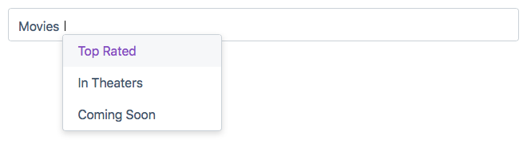
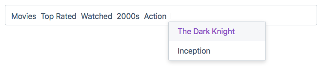

# AutoCompleTree

AutoCompleTree is a pure JavaScript autosuggest widget lets you select child nodes of JSON data.




## Download
* CSS: [autocompletree.css](src/autocompletree.css) - [autocompletree.min.css](dist/autocompletree.min.css)
* JavaScript: [autocompletree.js](src/autocompletree.js) - [autocompletree.min.js](dist/autocompletree.min.js)

## Install
Include **autocompletree.min.css** and **autocompletree.min.js** in your page.

```html
<link rel="stylesheet" href="autocompletree.min.css" />
<script src="autocompletree.min.js"></script>
```

## Usage
Add **data-autocompletree** and **data-path** attributes to the following input tag.

```html
<input type="text" data-path=“jsonFile.json” data-autocompletree />
```


> Sample JSON file (jsonFile.json):

```html
{
	"Movies": {
		"Watched":{
				"Action": {
                    "The Dark Knight": true,
                    "Pulp Fiction": true
                    "Inception": true
                },
                "Drama": {
                    "City of God": true,
                    "Interstellar": true
                }
			},
			"Watch List":{
				"Action": {
                    "Snatch": true,
                    "Batman Begins": true,
                    "Unforgiven": true
                },
                "Drama": {
                    "The Hunt":true,
                    "A Separation":true
                }
			}
	},
	"TV Shows": {
		"Westworld":true,
		"Game of Thrones": true,
		"Bron-Broen":true
	}
}
```

Or you can instantiate with Javascript code:

```html
<input type="text" id="myInput" />
```

```html
<script>
var sampleData = {
	"Movies" :{
		"Action": {
             "The Dark Knight": true,
             "Pulp Fiction": true
             "Inception": true
         },
         "Drama": {
             "City of God": true,
             "Interstellar": true
         }
	},
	"TV Shows": {
		"Westworld":true,
		"Game of Thrones": true,
		"Bron-Broen":true
	}
};
var myComponent = new AutoCompleTree(document.getElementById(myInput), sampleData);
</script>
```

## Features
When you focus on the input, the suggestion list will show up, then you can:
- Press `UP & DOWN` keys to move through suggestions.
- Press `ENTER` to select suggestion.
- Press `ESC` to hide suggestion list.
- Press `BACKSPACE` to select last item. When the last item is selected, press `TAB` to deselect or press `BACKSPACE` again to delete it.

## Instance Methods
AutoComplete instance has following methods:

| Method | Description |
| ------ | ------ |
| show | Show suggestions. |
| hide | Hide suggestions. |
| destroy | Destroy autocomplete instance. All events are detached and suggestion containers removed. |
| getData | Return a string of selected data that joined by ‘.’ |
| getSuggestions | Return a string array of current suggestions |
| getLastSelected | Return last selected item  |
| getSelectedList | Return a string array of selected data |
| selectItemAtIndex | Select item (suggestion) by specific index |

```html
myComponent.getData();
// "Movies.Watched.Action.Inception"

myComponent.getSelectedList();
// ["Movies","Watched","Action","Inception"]

myComponent.getLastSelected();
// "Inception"
```

## Browser Support
Chrome, Edge, Firefox


## Licence
This project is licensed under the MIT License - see the LICENSE.md file for details.